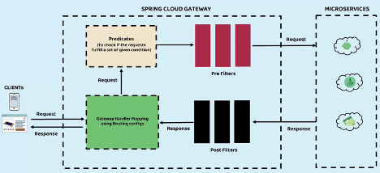

# Gateway Server

Es un servidor que sirve como puerta de enlace a los microservicios que acepta las llamadas de los clientes externos, maneja tareas relacionadas con los servicios de API, como autenticación de usuarios, limitación de velocidad y monitoreo. Es una capa se encuentra entre el consumidor y el proveedor de API (microservicios).

Cuando un consumidor de API envía una solicitud a API Gateway pasará por tres fases:
Primer etapa - Flujo de solicitud: La solicitud se autoriza, válida y transforma para un endpoint en el back-end. Aquí, el proveedor de la API puede requerir un encabezado HTTP, una cadena de consulta o una clave de API en particular, para identificar a una persona que llama y rechazar cualquier solicitud no autorizada o aplicar un límite de cuota o limitación.
Segunda etapa consiste en enrutar al servicio solicitado. Una solicitud puede enrutarse a una función en AWS Lambda u otro recurso de AWS. Aquí es donde ocurre la acción, es decir, se procesa la solicitud.
Tercer etapa - Flujo de Respuesta: La solicitud se transformará una vez más para enviarla de vuelta al cliente, la cual incluye un status http para indicar si la solicitud fue exitosa o erronea.

La mayoría de las API Gateway manejan la autenticación de usuarios y la limitación de velocidad, lo que puede ayudar a evitar que se abuse accidental o intencionalmente de tu API. De igual forma, suelen ofrecer análisis y monitoreo para realizar un seguimiento de cómo las personas usan tus API y servicios.

# Resiliencia en MicroServicios
## Patrón de Romper Circuito (Circuit Breaker Pattern)

Es un patrón de desarrollo de cualquier aplicación web o cualquier red de microservicios, la cual consiste en la auto-recuperación 
de instancias que fallaron por cualquier problema de red, respuesta lenta, etc. Estos evitará que las solicitudes de los
clientes se queden en espera o inclusive pueda tirar la red de microservicios, ya que no recibe respuesta de alguno.
Entonces Circuit Breaker Pattern evita que se haga solicitudes cuando haya servicios caidos, y va a intentar recuperar los servicios
caidos, mediante solicitudes periodicas. Tambien Permite liberar cargas de manera rápida, al tiempo que protege ante 
picos o ráfagas de peticiones que probablemente fallen.

url:
- http://localhost:8072/actuator/circuitbreakers
- http://localhost:8072/actuator/circuitbreakerevents?name=accountsCircuitBreaker

